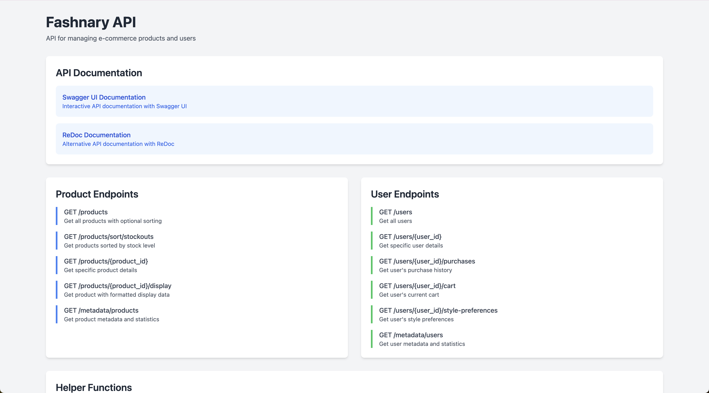
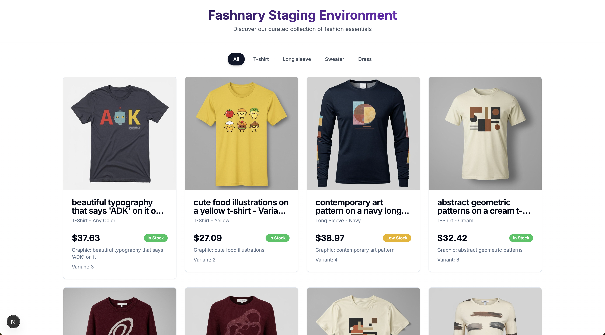

# Fashnary - AI Agent Bake Off - Google
To help with the AI Agent Bake we made this starter code.

You will have access to the `product_database.json` which will act as your "database" for the back-off. Please review the Dependencies section and contact us if you are facing any issues getting this code running locally.

Note for this competition we are focusing the Agent Developer Kit uniqueness, so feel free to ignore the frontend design elements. 

## Folder Structure

## Mock Database

The `product_database.json` file serves as your mock database with the following structure:

```json
{
  "products": [
    {
      "id": "1",
      "image_path": "path/to/image.jpg",
      "description": "Product description",
      "type": "t-shirt",
      "color": "black",
      "graphic": "logo",
      "variant": "regular",
      "stock": 50,
      "price": 29.99,
      "created_at": "2024-03-14T12:00:00Z"
    },
    // ... more products
  ],
  "metadata": {
    "total_products": 216,
    "types": {
      "t-shirt": 84,
      "sweater": 44,
      "dress": 44,
      "long sleeve": 44
    },
    "price_range": {
      "min": 20.12,
      "max": 129.85,
      "average": 54.01
    },
    "stock_stats": {
      "total": 10656,
      "average": 49.33
    },
    "generated_at": "2024-03-14T12:00:00Z"
  }
}
```

The `users_database.json` file contains user data with the following structure:

```json
{
  "users": [
    {
      "id": "user_1",
      "name": "John Doe",
      "description": "Fashion enthusiast",
      "style_preferences": ["t-shirt", "sweater"],
      "image_url": "path/to/user/image.jpg",
      "purchase_history": ["1", "2", "3"],
      "cart_status": {
        "items": [
          {
            "product_id": "4",
            "quantity": 2,
            "added_at": "2024-03-14T12:00:00Z"
          }
        ],
        "total_items": 1,
        "total_price": 59.98
      },
      "created_at": "2024-03-14T12:00:00Z"
    }
  ],
  "metadata": {
    "total_users": 50,
    "generated_at": "2024-03-14T12:00:00Z",
    "stats": {
      "total_purchases": 150,
      "total_cart_items": 75,
      "total_cart_value": 2999.50
    }
  }
}
```

### Database Structure

1. **Products Array**
   - Each product is a JSON object with the following fields:
     - `id`: Unique identifier (string)
     - `image_path`: Path to product image (string)
     - `description`: Product description (string)
     - `type`: Product category (string)
     - `color`: Product color (string)
     - `graphic`: Type of graphic on product (string)
     - `variant`: Product variant (string)
     - `stock`: Available quantity (integer)
     - `price`: Product price (float)
     - `created_at`: Creation timestamp (ISO 8601 string)

2. **Users Array**
   - Each user is a JSON object with the following fields:
     - `id`: Unique identifier (string)
     - `name`: User's name (string)
     - `description`: User description (string)
     - `style_preferences`: List of preferred product types (array of strings)
     - `image_url`: Path to user's profile image (string)
     - `purchase_history`: List of purchased product IDs (array of strings)
     - `cart_status`: Current shopping cart status (object)
       - `items`: List of cart items with product ID, quantity, and added timestamp
       - `total_items`: Total number of items in cart
       - `total_price`: Total price of cart items
     - `created_at`: Creation timestamp (ISO 8601 string)

3. **Metadata Objects**
   - Contains aggregated statistics about the products:
     - `total_products`: Total number of products
     - `types`: Distribution of products by type
     - `price_range`: Min, max, and average prices
     - `stock_stats`: Total and average stock levels
     - `generated_at`: Timestamp of metadata generation

## Features

### Backend (FastAPI)
- Get all products with optional sorting
- Get products sorted by stockouts (lowest stock first)
- Get individual product details by ID
- Get formatted product display data with images
- CORS enabled for cross-origin requests



*The FastAPI auto-generated interactive API documentation (Swagger UI) for Fashnary.*

#### Avaliable Endpoints

1. **Get All Products**
   ```
   GET /products
   ```
   - Returns the full products array
   - Supports sorting by various fields

2. **Get Product by ID**
   ```
   GET /products/{product_id}
   ```
   - Returns a single product by its ID

3. **Get Product Display**
   ```
   GET /products/{product_id}/display
   ```
   - Returns formatted product data with base64 encoded image

4. **Get Metadata**
   ```
   GET /metadata
   ```
   - Returns the pre-calculated metadata statistics

5. **User Endpoints**

   a. **Get All Users**
   ```
   GET /users
   ```
   - Returns the full users array

   b. **Get User by ID**
   ```
   GET /users/{user_id}
   ```
   - Returns a single user by their ID

   c. **Get User's Purchases**
   ```
   GET /users/{user_id}/purchases
   ```
   - Returns list of products purchased by the user
   - Includes full product details

   d. **Get User's Cart**
   ```
   GET /users/{user_id}/cart
   ```
   - Returns current cart status
   - Includes items, quantities, and total price

   e. **Get User's Style Preferences**
   ```
   GET /users/{user_id}/style-preferences
   ```
   - Returns list of user's preferred product types

   f. **Get Users Metadata**
   ```
   GET /users/metadata
   ```
   - Returns statistics about all users
   - Includes total users, purchases, cart items, etc.

### Frontend (Next.js)
- Modern, responsive product catalog
- Category filtering
- Smooth animations and transitions
- Real-time stock status indicators
- Beautiful product cards with images
- Mobile-friendly design



*A sample of the Fashnary e-commerce website frontend UI.*


## Installation

### Backend Setup

1. Clone the repository:
```bash
git clone https://github.com/goabego/ai-bake-off-fashnary
cd ai-bake-off-fashnary
```

2. Install dependencies using Poetry:
```bash
poetry install
```

3. Run the API server:
```bash
poetry run uvicorn api:app --reload
```

The API will be available at `http://localhost:8000`

### Frontend Setup

1. Navigate to the frontend directory:
```bash
cd frontend
```

2. Install dependencies:
```bash
npm install
```

3. Run the development server:
```bash
npm run dev
```

The frontend will be available at `http://localhost:3000`

## API Documentation

Once the server is running, you can access the interactive API documentation at:
- Swagger UI: `http://localhost:8000/docs`
- ReDoc: `http://localhost:8000/redoc`

### Endpoints

#### GET /products

Get all products with optional sorting.

Query Parameters:
- `sort_by` (optional): Field to sort by. Must be one of: "stock", "price", "created_at"
- `order` (optional): Sort order. Must be either "asc" or "desc". Defaults to "asc"

Example:
```bash
# Get all products
GET /products

# Get products sorted by price in descending order
GET /products?sort_by=price&order=desc
```

#### GET /products/sort/stockouts

Get all products sorted by stock level (lowest to highest). Products with 0 stock will appear first.

Example:
```bash
GET /products/sort/stockouts
```

#### GET /products/{product_id}

Get a specific product by ID.

Example:
```bash
GET /products/42
```

#### GET /products/{product_id}/display

Get a specific product by ID with formatted display data including the base64 encoded image.

Example:
```bash
GET /products/42/display
```

Response format:
```json
{
    "id": "string",
    "image": "data:image/jpeg;base64,...",
    "description": "string",
    "type": "string",
    "color": "string",
    "graphic": "string",
    "variant": "string",
    "stock": "integer",
    "price": "string",
    "created_at": "string",
    "stock_status": "string"
}
```

The image is returned as a base64 encoded string that can be directly used in an HTML img tag:
```html

```

#### User Endpoints

##### GET /users

Get all users.

Example:
```bash
GET /users
```

Response format:
```json
[
  {
    "id": "string",
    "name": "string",
    "description": "string",
    "style_preferences": ["string"],
    "image_url": "string",
    "purchase_history": ["string"],
    "cart_status": {
      "items": [
        {
          "product_id": "string",
          "quantity": "integer",
          "added_at": "string"
        }
      ],
      "total_items": "integer",
      "total_price": "float"
    },
    "created_at": "string"
  }
]
```

##### GET /users/{user_id}

Get a specific user by ID.

Example:
```bash
GET /users/user_1
```

##### GET /users/{user_id}/purchases

Get all products purchased by a specific user.

Example:
```bash
GET /users/user_1/purchases
```

##### GET /users/{user_id}/cart

Get the current cart status for a specific user.

Example:
```bash
GET /users/user_1/cart
```

Response format:
```json
{
  "items": [
    {
      "product_id": "string",
      "quantity": "integer",
      "added_at": "string"
    }
  ],
  "total_items": "integer",
  "total_price": "float"
}
```

##### GET /users/{user_id}/style-preferences

Get the style preferences for a specific user.

Example:
```bash
GET /users/user_1/style-preferences
```

Response format:
```json
["string"]
```

##### GET /users/metadata

Get metadata about all users.

Example:
```bash
GET /users/metadata
```

Response format:
```json
{
  "total_users": "integer",
  "generated_at": "string",
  "stats": {
    "total_purchases": "integer",
    "total_cart_items": "integer",
    "total_cart_value": "float"
  }
}
```

## Development

### Project Structure

```